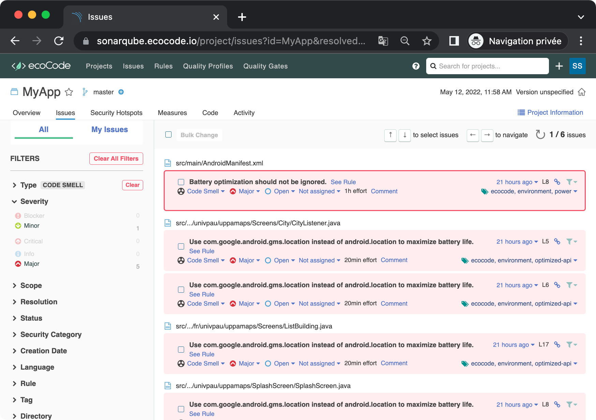

Mobile apps running on top of battery-limited devices are more than others concerned by the reduction of their environmental footprint. Hence, we created `ecoCode mobile`, the mobile-specific version of the ecoCode project. It provides static code analyzers to highlight code structures that may have a negative ecological impact: energy over-consumption, "fatware", shortening devices' lifespan, etc.

ecoCode mobile is based on evolving catalogs of [best practices](https://olegoaer.perso.univ-pau.fr/android-energy-smells/), for Android and iOS (soon). A SonarQube plugin then implement these catalogs as rules for scanning your projects.


[](https://www.gnu.org/licenses/gpl-3.0)

## 🌿 SonarQube Plugin

1 mobile technology is supported by the plugin right now:
- [Android](android-plugin/)



<sub>The ecoCode look&amp;feel depicted above is not part of this open source project</sub>

## 🤝 Partners
[](https://www.snapp.fr)
[](https://www.univ-pau.fr/)
[](https://www.nouvelle-aquitaine.fr)


## How to cite this work?

If you use ecoCode in an academic work we would be really glad if you cite our seminal paper using the following bibtex (to appear):
```bibtex
@inproceedings{DBLP:conf/ase/LeGoaer2022,
  author    = {Olivier Le Goaer and Julien Hertout},
  title     = {ecoCode: a SonarQube Plugin to Remove Energy Smells from Android Projects},
  booktitle = {{ACM/IEEE} International Conference on Automated Software Engineering,
               {ASE} '22, Michigan, USA - October 10 - 14, 2022},
  year      = {2022}
}
```
